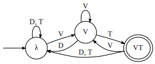

---
title: Lifting to Functions
author: Dakotah Lambert
...

The Nerode equivalence relation defined by a string language
says that two words are equivalent
iff there is no suffix that distinguishes them:
𝑎⁓𝑏 iff for all 𝑣, 𝑎⁣𝑣 and 𝑏⁣𝑣 are
either both in or both out of the language.
Equivalence classes under this relation
define the states of the minimal deterministic acceptor
that represents the language.
An equivalence defined by the
**tails** function describes the same thing
over string-to-string functions,
which strings can be distinguished by some suffix.

𝑇𝑓(𝑥)={⟨𝑦,𝑣⟩:𝑓(𝑥⁣𝑦)=lcp(𝑥⁣Σ\*)⁣𝑣}

The natural extension of the Nerode relation to functions is then
𝑎⁓𝑏 iff for all 𝑣, 𝑇(𝑎⁣𝑣)=𝑇(𝑏⁣𝑣).
In this definition,
lcp(𝑥⁣Σ\*) is the portion of the output
that is reasonably attributed to 𝑥,
leaving 𝑣 as the portion attributed to 𝑦.
That is, 𝑇𝑓(𝑥) yields a function
mapping strings to what they contribute to the output
when suffixed onto an input 𝑥.

The Myhill relation is a two-sided version of the Nerode relation:
𝑎⁓𝑏 iff for all 𝑢 and 𝑣, 𝑢⁣𝑎⁣𝑣 and 𝑢⁣𝑏⁣𝑣 are
either both in or both out of the language.
In other words,
we describe the contributions of prefixes and suffixes.
I define the **contexts** function to describe this.

𝐶𝑓(𝑥)={⟨𝑢,𝑦,𝑣⟩:𝑓(𝑢⁣𝑥⁣𝑦)=lcp(𝑢⁣𝑥⁣Σ\*)⁣𝑣}

In other words, 𝐶𝑓(𝑥) yields a function
mapping two-sided contexts to what they contribute to the output
when an input 𝑥 is placed into those contexts.
This analogizes the Myhill relation,
and allows use to form a quotient monoid of Σ\*
by the same algorithm used for acceptors.

Consider the following transducer:
 

 
It represents a rule where T becomes D when between two V.
We write this as T→D/V\_\_V.
Following the same process which converts minimal acceptors
into (right Cayley graphs of) syntactic monoids,
we can convert this transducer into
the monoid described by the following graph:
 

Given this presentation,
it looks as if the outputs are irrelevant.
And in a sense they are —
the outputs define the shape of the minimal transducer,
and the monoid is derived from this shape,
so anything that retains the same minimal structure
is going to have the same monoid.
An acceptor with the same structure
as that minimal transducer follows:
 

 
This accepts the set of strings that end on VT,
a **definite language**.

Then T→D/V__V is a **definite function**.
(Verify: check that 𝑆⁢𝑒=𝑒.)
However, it is worth pointing out that directionality matters.
The reversal of a definite language
is a reverse-definite language (how clever),
but this definite function acts identically
whether reading the string left-to-right or right-to-left.
So it is definite in both directions,
and not reverse-definite in either.
Functions that are definable by a deterministic transducer
in one direction are not even necessarily
definable at all by a determinsitic transducer in the other direction.

So I propose that for each string-language class
there are multiple corresponding string-to-string function classes.
Here we have encountered a function that is both
→Def (definite when reading input left-to-right) and
←Def (definite when reading input right-to-left).
One might even say this particular function is
↔Def.
I'm going to pronounce the arrows as
"front" (→), "back" (←), and "bidirectionally" (↔),
until somebody proposes something better.
