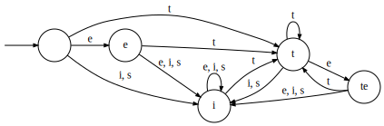
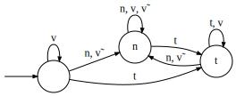

---
title: Classying Example Functions
author: Dakotah Lambert
...

Diagrams in this document, as in others prior,
were automatically generated by code built upon the Language Tookit
with minimal changes to the resultant output.

We first explore a process in Finnish,
in which word-final "te" becomes "si".
This is written te→si/_#.
(Scott tells me that the actual rule is slightly different.)
The rule as discussed is defined by the following transducer: 
 
The first step in classification is to verify
that the machine is minimal and deterministic,
and it is.
The second step is to construct the transition monoid
(the syntactic monoid): 
 
The identity state is not reachable by a nonempty sequence,
so we'll leave it out of the Cayley table (it's not in the semigroup):

|    |  e |  i |  t | te |
|:--:|:--:|:--:|:--:|:--:|
|  e |  i |  i |  t | te |
|  i |  i |  i |  t | te |
|  t | te |  i |  t | te |
| te |  i |  i |  t | te |

Recall that 𝑒⁢𝑆 is the row containing 𝑒, and 𝑆⁢𝑒 is its column.
The idempotents are 𝐸={i, t, te}.

|    |   𝑒⁢𝑆   | 𝑆⁢𝑒 | 𝑒⁢𝑆⁢𝑒 |
|:--:|:------:|:--:|:---:|
|  i | i,te   |  i |  i  |
|  t | i,t,te |  t |  t  |
| te | i,t,te | te | te  |

We see that 𝑆⁢𝑒=𝑒, so this is a definite function!
Remember that directionality can matter,
so because this machine reads the input from right to left it is →Def.
(Exercise: is the function also ←Def?)

What is a definite language?
A definite language is one in which for some 𝑘,
the most recent 𝑘−1 symbols of the input determine the state.
This is the same property
that defines the (total) input strictly local (ISL) maps!
Every total ISL function is definite.

How about some non-ISL functions?
One is a progressive harmony pattern.
Consider an alphabet "b", "i", and "u",
where if the first vowel is "i" then all later vowels become "i",
and if the first vowel is "u" then all laters vowels become "u".
Such a transducer appears below: 
 
The shape of the monoid is identical,
1 is λ, 2 is i and 3 is u.
This time the identity is reachable by a nonempty string: b.
So it remains in the semigroup:

|   | λ | i | u |
|:-:|:-:|:-:|:-:|
| λ | λ | i | u |
| i | i | i | i |
| u | u | u | u |

Every element is idempotent
(so this is a band, but not a commutative band).

|   |   𝑒⁢𝑆  |  𝑆⁢𝑒   |  𝑒⁢𝑆⁢𝑒  |
|:-:|:-----:|:-----:|:-----:|
| λ | λ,i,u | λ,i,u | λ,i,u |
| i |   i   |  i,u  |   i   |
| u |   e   |  i,u  |   u   |

This is _almost_ reverse definite.
That pesky identity is in there being, well, an identity.
But if that "b" wasn't there making it accessible,
then it wouldn't be in the semigroup.
The only way the identity is accessible is this self-loop,
so it's _tier-based_ reverse definite!

Looking at two-sided ideals, we see that
𝐼₂(λ)={λ,i,u}, 𝐼₂(i)={i,u}, and 𝐼₂(u)={i,u}.
Two of these are the same:
i𝒥u but i≠u
and so this function is not piecewise testable (PT).
This is despite the fact that
the corresponding surface pattern is strictly piecewise,
a subclass of PT.

Another non-ISL function is iterative spreading. 
 
Its monoid is as follows: 

|   | λ | n | t |
|:-:|:-:|:-:|:-:|
| λ | λ | n | t |
| n | n | n | t |
| t | t | n | t |

Looking at the columns of this table,
this semigroup would be definite if not for the identity.
But as before it is only reachable via self-loop.
Thus, it is →TDef, tier-based definite.
It is perhaps odd that the nonsalient symbol
is the one undergoing change: v.

A summary of this exploration so far seems to be that:

* input strictly local functions are definite
* tier-based stuff is better at capturing what we see than precedence
